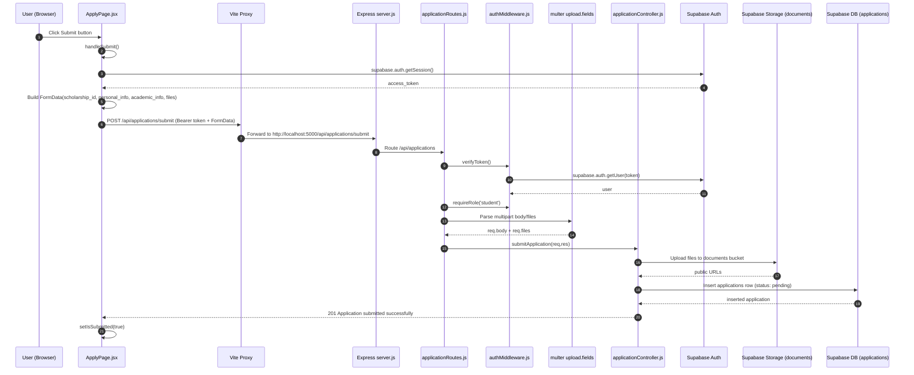

# Signup & Email Verification Workflow

## Overview

This document explains the complete workflow from user registration through email verification to login redirect, including all files responsible for each action.

---

## Complete Flow Diagram

```
┌─────────────────────────────────────────────────────────────────────────────┐
│                           SIGNUP WORKFLOW                                    │
└─────────────────────────────────────────────────────────────────────────────┘

  1. User fills form                    2. Frontend Validation
  ┌──────────────────────┐              ┌──────────────────────────────────┐
  │ RegisterPage.jsx     │              │ AuthContext.jsx                  │
  │ - role selection     │──────────►   │ - validateEmail()                │
  │ - form fields        │              │ - validatePassword()             │
  │ - submit handler     │              │ - validateMetadata()             │
  └──────────────────────┘              │ - buildExtraInfo()               │
                                        └──────────────────────────────────┘
                                                      │
                                                      ▼
                                        ┌──────────────────────────────────┐
                                        │ registerUser() → /api/auth/register│
                                        └──────────────────────────────────┘
                                                      │
                                                      ▼
  3. Backend Registration           4. Supabase Auth + Profile Creation
  ┌──────────────────────────┐      ┌──────────────────────────────────────┐
  │ authController.js        │      │ supabaseClient.js                    │
  │ registerUser()           │─────►│ - supabase.auth.signUp()             │
  │ - receives request       │      │   (creates auth user)                │
  │ - validates input        │      │ - supabaseAdmin.profile.upsert()     │
  │ - calls Supabase         │      │   (creates profile with status)      │
  └──────────────────────────┘      └──────────────────────────────────────┘
                                                      │
                                                      ▼
  5. Email Sent to User             6. User Clicks Verification Link
  ┌──────────────────────────┐      ┌──────────────────────────────────────┐
  │ Supabase handles email   │      │ Supabase confirms email              │
  │ - verification link      │      │ - Sets email_confirmed_at timestamp  │
  │ - contains token/redirect│      │ - User can now login                 │
  └──────────────────────────┘      └──────────────────────────────────────┘
                                                      │
                                                      ▼
  7. User Attempts Login           8. Login Validation
  ┌──────────────────────────┐      ┌──────────────────────────────────────┐
  │ LoginPage.jsx            │      │ authController.js                    │
  │ - user enters credentials│─────►│ loginUser()                          │
  │ - signIn() called        │      │ - signInWithPassword()               │
  └──────────────────────────┘      │ - Check email_confirmed_at           │
                                    │ - Check profile.status === 'approved' │
                                    └──────────────────────────────────────┘
                                                      │
                                    ┌─────────────────┴─────────────────┐
                                    │                                       │
                                    ▼                                       ▼
                         ┌──────────────────┐              ┌──────────────────────┐
                         │ ERROR: Not       │              │ SUCCESS: Login       │
                         │ verified/approved│              │ Returns token        │
                         └──────────────────┘              └──────────────────────┘
                                                                      │
                                                                      ▼
  9. Redirect to Dashboard           10. Dashboard Loaded
  ┌──────────────────────────┐      ┌──────────────────────────────────────┐
  │ LoginPage.jsx            │      │ AuthContext.jsx                      │
  │ - navigate() based on    │─────►│ - fetchProfile() via /api/auth/me    │
  │   user role              │      │ - Sets profile state                 │
  └──────────────────────────┘      │ - Provides user data to components   │
                                     └──────────────────────────────────────┘
```

---

## Step-by-Step Detailed Explanation

### PHASE 1: REGISTRATION

#### Step 1: User Fills Registration Form
**File:** [`RegisterPage.jsx`](frontend/src/pages/RegisterPage.jsx:33)

- User selects role (student/donor/admin) via tabs
- Fills role-specific form fields
- Clicks "Register" button
- `handleSubmit()` is triggered (line 48)

```javascript
// Line 48-73 in RegisterPage.jsx
async function handleSubmit(e) {
  e.preventDefault()
  // ... validation ...
  await signUp(email, password, metadata)  // Line 66
  setRegistered(true)  // Show success message
}
```

#### Step 2: Frontend Validation
**File:** [`AuthContext.jsx`](frontend/src/context/AuthContext.jsx:127)

The `signUp()` function performs validation before sending to backend:

| Function | Purpose | Lines |
|----------|---------|-------|
| [`validateEmail()`](frontend/src/context/AuthContext.jsx:76) | Checks email format using regex | 76-87 |
| [`validatePassword()`](frontend/src/context/AuthContext.jsx:89) | Ensures password ≥ 8 chars | 89-99 |
| [`validateMetadata()`](frontend/src/context/AuthContext.jsx:101) | Sanitizes metadata fields | 101-125 |
| [`buildExtraInfo()`](frontend/src/context/AuthContext.jsx:139) | Prepares metadata for API | 139-151 |

#### Step 3: Backend Registration Handler
**File:** [`authController.js`](backend/controllers/authController.js:3)

```javascript
// registerUser() - Lines 3-51
export const registerUser = async (req, res) => {
  const { email, password, metadata } = req.body  // Line 4
  
  // 1. Validate required fields
  if (!email || !password) {
    return res.status(400).json({ error: 'Email and password are required.' })
  }
  
  // 2. Create auth user in Supabase
  const { data: authData, error: authError } = await supabase.auth.signUp({
    email,
    password,
    options: { data: metadata || {} }
  })
  
  // 3. Create profile in profiles table
  const { error: profileError } = await supabaseAdmin
    .from('profiles')
    .upsert({
      id: authData.user.id,
      email: authData.user.email,
      full_name: fullName,
      role,
      status: 'pending_approval',  // KEY: Initial status
      extra_info: extraInfo
    }, { onConflict: 'id' })
}
```

#### Step 4: Supabase Client Configuration
**File:** [`supabaseClient.js`](backend/config/supabaseClient.js:10)

```javascript
// Two clients created:
export const supabase = createClient(supabaseUrl, supabaseAnonKey)      // User-level access
export const supabaseAdmin = createClient(supabaseUrl, supabaseServiceKey)  // Admin access (bypasses RLS)
```

---

### PHASE 2: EMAIL VERIFICATION

#### Step 5: Supabase Sends Verification Email
**File:** Handled by Supabase automatically

When `supabase.auth.signUp()` is called, Supabase:
- Creates auth user with `email_confirmed_at: null`
- Sends verification email with a confirmation link
- The link contains a token to confirm the email

#### Step 6: User Clicks Verification Link
**File:** Handled by Supabase automatically

When user clicks the link:
- Supabase validates the token
- Updates `email_confirmed_at` timestamp in auth.users
- Redirects user to application (configurable in Supabase)

---

### PHASE 3: LOGIN

#### Step 7: User Attempts Login
**File:** [`LoginPage.jsx`](frontend/src/pages/LoginPage.jsx:15)

```javascript
// handleSubmit() - Lines 15-29
async function handleSubmit(e) {
  e.preventDefault()
  const data = await signIn(form.email, form.password)  // Line 21
  const role = data.user?.role ?? 'student'
  navigate(getDashboardPath(role))  // Line 23 - Redirect!
}
```

#### Step 8: Backend Login Validation
**File:** [`authController.js`](backend/controllers/authController.js:53)

```javascript
// loginUser() - Lines 53-93
export const loginUser = async (req, res) => {
  const { email, password } = req.body
  
  // 1. Authenticate with Supabase
  const { data, error } = await supabase.auth.signInWithPassword({ email, password })
  
  // 2. CHECK 1: Email confirmed?
  if (!data.user?.email_confirmed_at) {
    return res.status(403).json({ error: 'Please confirm your email before logging in.' })
  }
  
  // 3. Get profile and CHECK 2: Status approved?
  const { data: profile } = await supabaseAdmin
    .from('profiles')
    .select('status, role, full_name, email')
    .eq('id', data.user.id)
    .single()
  
  if (!profile || profile.status !== 'approved') {
    return res.status(403).json({ error: 'Your account is pending admin approval.' })
  }
  
  // 4. Return token and user data
  return res.status(200).json({
    token: data.session.access_token,
    user: { id, email, full_name, role }
  })
}
```

---

### PHASE 4: ADMIN APPROVAL (Required for Login)

#### Step 9: Admin Approves User
**File:** [`adminController.js`](backend/controllers/adminController.js:32)

```javascript
// updateUserApprovalStatus() - Lines 32-60
export const updateUserApprovalStatus = async (req, res) => {
  const { id } = req.params
  const { status } = req.body  // 'approved' or 'rejected'
  
  const { data, error } = await supabaseAdmin
    .from('profiles')
    .update({ status })
    .eq('id', id)
    .select('id, full_name, email, role, status')
    .single()
}
```

---

### PHASE 5: REDIRECT TO DASHBOARD

#### Step 10: Role-Based Redirect
**File:** [`AuthContext.jsx`](frontend/src/context/AuthContext.jsx:55)

```javascript
// getDashboardPath() - Lines 55-59
function getDashboardPath(role) {
  if (role === 'donor') return '/donor/dashboard'
  if (role === 'admin') return '/admin/dashboard'
  return '/dashboard'  // Default for 'student'
}
```

#### Step 11: Dashboard Loads Profile
**File:** [`AuthContext.jsx`](frontend/src/context/AuthContext.jsx:27)

```javascript
// fetchProfile() - Lines 27-53
async function fetchProfile() {
  const response = await fetch('/api/auth/me', {
    headers: { Authorization: `Bearer ${token}` }
  })
  const payload = await response.json()
  setProfile(payload?.user ?? null)
}
```

---

## Files Summary Table

| File | Responsibility | Key Functions |
|------|---------------|---------------|
| [`RegisterPage.jsx`](frontend/src/pages/RegisterPage.jsx:33) | Registration form UI | `handleSubmit()` |
| [`AuthContext.jsx`](frontend/src/context/AuthContext.jsx:127) | Auth state & validation | `signUp()`, `signIn()`, `getDashboardPath()` |
| [`authController.js`](backend/controllers/authController.js:3) | Backend auth logic | `registerUser()`, `loginUser()` |
| [`authRoutes.js`](backend/routes/authRoutes.js:7) | Auth API routes | `/register`, `/login`, `/me` |
| [`supabaseClient.js`](backend/config/supabaseClient.js:10) | Supabase clients | `supabase`, `supabaseAdmin` |
| [`LoginPage.jsx`](frontend/src/pages/LoginPage.jsx:7) | Login form UI | `handleSubmit()` |
| [`adminController.js`](backend/controllers/adminController.js:32) | Admin approval | `updateUserApprovalStatus()` |

---

## Status Flow

```
┌─────────────────┐     signUp()      ┌─────────────────────┐
│   Initial       │──────────────────►│  pending_approval   │
│   State         │   (profile row    │  (email NOT sent)   │
└─────────────────┘    created)       └─────────────────────┘
                                              │
                          ┌───────────────────┴───────────────────┐
                          │                                       │
                          ▼                                       ▼
               ┌─────────────────────┐               ┌─────────────────────┐
               │ User clicks email   │               │ Admin approves      │
               │ verification link   │               │ in AdminDashboard   │
               └─────────────────────┘               └─────────────────────┘
                          │                                       │
                          ▼                                       │
               ┌─────────────────────┐                            │
               │ email_confirmed_at  │                            │
               │ is NOW set          │                            │
               └─────────────────────┘                            │
                          │                                       │
                          └───────────────────┬───────────────────┘
                                              │
                                              ▼
                                   ┌─────────────────────┐
                                   │ status === 'approved'│
                                   │ CAN NOW LOGIN       │
                                   └─────────────────────┘
```

---

## Error Messages at Login

| Condition | Error Message | Source |
|-----------|--------------|--------|
| Wrong password | `Invalid email or password.` | [`authController.js:63`](backend/controllers/authController.js:63) |
| Email not confirmed | `Please confirm your email before logging in.` | [`authController.js:67`](backend/controllers/authController.js:67) |
| Not approved by admin | `Your account is pending admin approval.` | [`authController.js:77`](backend/controllers/authController.js:77) |

---

## Application Submit Workflow (Phase 2: Frontend to Backend Bridge)

This section explains exactly what happens when a student clicks **Submit** on the application form in [`ApplyPage.jsx`](frontend/src/pages/ApplyPage.jsx:96), including the order of files and blocks that execute.

### Why `FormData` is used

- `JSON` can carry text only.
- Application submission includes text fields plus real files (PDF/JPG/PNG).
- `FormData` sends `multipart/form-data`, which lets backend middleware (`multer`) parse both text and binary files.

### Request Sequence Diagram



### Exact Execution Order (File by File)

1. **Button click triggers submit handler**
  - File: [`ApplyPage.jsx`](frontend/src/pages/ApplyPage.jsx:336)
  - Block: `onClick={handleSubmit}`

2. **Frontend submit function runs**
  - File: [`ApplyPage.jsx`](frontend/src/pages/ApplyPage.jsx:96)
  - Block: `async function handleSubmit()`
  - Reads user token with Supabase client from [`supabaseClient.js`](frontend/src/services/supabaseClient.js:6)

3. **FormData package is assembled**
  - File: [`ApplyPage.jsx`](frontend/src/pages/ApplyPage.jsx:106)
  - Blocks:
    - `formData.append('scholarship_id', id)`
    - `formData.append('personal_info', JSON.stringify(personal))` ([line 108](frontend/src/pages/ApplyPage.jsx:108))
    - `formData.append('academic_info', JSON.stringify(academic))` ([line 109](frontend/src/pages/ApplyPage.jsx:109))
    - Optional files (`grades`, `id_card`, `essay`) ([line 111](frontend/src/pages/ApplyPage.jsx:111))

4. **Network call is sent to API bridge URL**
  - File: [`ApplyPage.jsx`](frontend/src/pages/ApplyPage.jsx:115)
  - Block: `fetch('/api/applications/submit', { method: 'POST', headers: Authorization, body: formData })`

5. **Vite proxy forwards request to backend server**
  - File: [`vite.config.js`](frontend/vite.config.js:7)
  - Block: proxy `/api` -> `http://localhost:5000`

6. **Express receives request and maps route**
  - File: [`server.js`](backend/server.js:31)
  - Block: `app.use('/api/applications', applicationRoutes)`

7. **Route middleware chain starts**
  - File: [`applicationRoutes.js`](backend/routes/applicationRoutes.js:21)
  - Order:
    - `verifyToken`
    - `requireRole('student')`
    - `upload.fields([...])`
    - `submitApplication`

8. **Token is validated**
  - File: [`authMiddleware.js`](backend/middleware/authMiddleware.js:3)
  - Block: `verifyToken`
  - Reads header and checks token via `supabase.auth.getUser(token)` ([line 11](backend/middleware/authMiddleware.js:11))
  - Sets `req.user` ([line 17](backend/middleware/authMiddleware.js:17))

9. **Role is enforced**
  - File: [`authMiddleware.js`](backend/middleware/authMiddleware.js:21)
  - Block: `requireRole('student')`

10. **Multipart parser processes form and files**
  - File: [`applicationRoutes.js`](backend/routes/applicationRoutes.js:8)
  - Block: `multer(...)`
  - Config:
    - in-memory storage ([line 9](backend/routes/applicationRoutes.js:9))
    - max file size 10MB ([line 10](backend/routes/applicationRoutes.js:10))
    - allowed MIME types ([line 12](backend/routes/applicationRoutes.js:12))

11. **Controller reads body/files and validates scholarship**
  - File: [`applicationController.js`](backend/controllers/applicationController.js:12)
  - Block: `submitApplication`
  - Reads fields:
    - `req.user.id` ([line 14](backend/controllers/applicationController.js:14))
    - `req.body.scholarship_id` ([line 15](backend/controllers/applicationController.js:15))
    - Parses `personal_info` / `academic_info` with `safeJsonParse` ([line 16](backend/controllers/applicationController.js:16))
  - Validates scholarship is published ([line 26](backend/controllers/applicationController.js:26), [line 29](backend/controllers/applicationController.js:29))

12. **Duplicate application is checked**
  - File: [`applicationController.js`](backend/controllers/applicationController.js:37)
  - Block: query existing application by `student_id + scholarship_id`

13. **Files are uploaded to Supabase Storage**
  - File: [`applicationController.js`](backend/controllers/applicationController.js:47)
  - Blocks:
    - iterate `req.files` ([line 50](backend/controllers/applicationController.js:50))
    - upload to `documents` bucket ([line 59](backend/controllers/applicationController.js:59))
    - get public URL ([line 73](backend/controllers/applicationController.js:73))

14. **Application row is inserted into database**
  - File: [`applicationController.js`](backend/controllers/applicationController.js:82)
  - Block: `.from('applications').insert({ ... status: 'pending', document_urls })`

15. **Response returns to frontend and UI updates**
  - Backend returns `201` success
  - Frontend in [`ApplyPage.jsx`](frontend/src/pages/ApplyPage.jsx:127) calls `setIsSubmitted(true)`
  - Success card is shown in UI

### Field Mapping: Frontend -> Backend

| Frontend `FormData` Key | Backend Read Location | Notes |
|---|---|---|
| `scholarship_id` | `req.body.scholarship_id` | Required |
| `personal_info` | `req.body.personal_info` -> `safeJsonParse()` | JSON string |
| `academic_info` | `req.body.academic_info` -> `safeJsonParse()` | JSON string |
| `grades` | `req.files.grades[0]` | Required in UI step validation |
| `id_card` | `req.files.id_card[0]` | Required in UI step validation |
| `essay` | `req.files.essay[0]` | Optional |

### Quick Failure Points in This Path

- `401`: Missing/invalid bearer token in [`authMiddleware.js`](backend/middleware/authMiddleware.js:6)
- `403`: Logged-in user is not a student in [`authMiddleware.js`](backend/middleware/authMiddleware.js:25)
- `404`: Scholarship missing or not published in [`applicationController.js`](backend/controllers/applicationController.js:32)
- `409`: Duplicate application in [`applicationController.js`](backend/controllers/applicationController.js:44)
- `500`: Storage upload or DB insert failure in [`applicationController.js`](backend/controllers/applicationController.js:67)