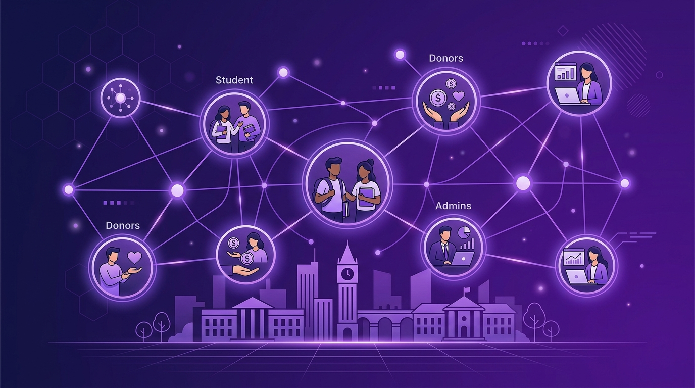

[comment]: # "This is the standard layout for the project, but you can clean this and use your own template"

# PeraCom Student Welfare Management System (PSWMS)

---

## Team
- E/23/040, V. Birunthan, [e23040@eng.pdn.ac.lk](mailto:e23040@eng.pdn.ac.lk)
- E/23/078, J. Dinushan, [e23078@eng.pdn.ac.lk](mailto:e23078@eng.pdn.ac.lk)
- E/23/245, B. Nilaxshan, [e23245@eng.pdn.ac.lk](mailto:e23245@eng.pdn.ac.lk)
- E/23/387, K. Srikaran, [e23387@eng.pdn.ac.lk](mailto:e23387@eng.pdn.ac.lk)

<!-- Image (photo/drawing of the final hardware) should be here -->

<!--  -->

#### Table of Contents
1. [Introduction](#introduction)
2. [Solution Architecture](#solution-architecture)
3. [Software Designs](#software-designs)
4. [Testing](#testing)
5. [Conclusion](#conclusion)
6. [Links](#links)

## Introduction

The **PeraCom Student Welfare Management System (PSWMS)** addresses the real-world challenge of managing university scholarships through manual, paper-based processes. At the University of Peradeniya, scholarship administration has historically suffered from:

- Manual, error-prone application tracking across hundreds of students
- Slow and opaque approval processes with no real-time status updates for applicants
- Lack of transparency for donors regarding fund allocation and utilization
- Physical document management leading to lost files and compliance risks
- No systematic workflow for donor-student matching and fund disbursement

**Solution:** PSWMS is a centralized, web-based platform that automates the entire scholarship lifecycle — from discovery to disbursement — through a role-based, transparent portal. It connects three key stakeholders:

- **Students** — Browse scholarships, apply via a 4-step wizard, track status in real-time, upload documents, and submit semester progress reports.
- **Donors** — Submit scholarship proposals, review assigned students, approve/reject applications, and verify payment disbursements with full audit trails.
- **Administrators** — Manage the full lifecycle: scholarship CRUD, application review, student-to-donor assignment, announcement publishing, issue resolution, and user account management.

**Impact:** Reduced administrative overhead, improved compliance, full transparency for donors, and a better experience for students seeking financial assistance.

## Solution Architecture

PSWMS follows a modern three-tier web architecture:

```
┌─────────────────────────────────────────────────────┐
│                    CLIENT TIER                       │
│   Student Portal | Donor Portal | Admin Dashboard   │
│              React 18 + Vite + Tailwind CSS         │
└───────────────────────┬─────────────────────────────┘
                        │ REST API (Axios + JWT)
┌───────────────────────▼─────────────────────────────┐
│                    API TIER                          │
│  Auth | Scholarships | Applications | Student |     │
│                Donor | Admin Routes                  │
│             Node.js + Express.js                    │
│         Middleware: JWT Auth · Multer               │
└───────────────────────┬─────────────────────────────┘
                        │ SQL / Supabase SDK
┌───────────────────────▼─────────────────────────────┐
│                    DATA TIER                         │
│     PostgreSQL via Supabase | Supabase Storage      │
│              bcryptjs Password Hashing              │
└─────────────────────────────────────────────────────┘
```

**Tech Stack:**

| Layer | Technology |
|-------|------------|
| Frontend | React 18 + Vite + Tailwind CSS |
| Routing | React Router v6 |
| HTTP Client | Axios |
| Backend | Node.js + Express.js |
| Database | PostgreSQL via Supabase |
| Authentication | JWT + bcryptjs |
| File Storage | Supabase Storage (`welfare-docs` bucket) |
| Charts | Recharts |

## Software Designs

### User Role Modules

**Student Module**
- Browse active scholarships (public + authenticated)
- 4-step guided application wizard with validation
- Multi-file document upload via Supabase Storage
- Real-time application status tracking
- Semester progress report submission
- Issue (support ticket) creation and tracking
- Profile management and editing

**Donor Module**
- Submit scholarship proposals for admin review
- Review assigned student dossiers
- Approve / reject individual student applications
- View semester progress reports
- Payment disbursement verification
- Targeted announcement viewing

**Admin Module**
- Live dashboard with stats and activity feed
- Full scholarship CRUD and donor request review
- Application review: approve / reject / request resubmission
- Student-to-donor assignment workflow
- User approval queue and account lifecycle (approve / suspend / activate)
- Announcement management: draft → publish → schedule
- Issue tracking with threaded admin replies

### Database Schema

| Table | Description |
|-------|-------------|
| `users` | All roles — admin, student, donor |
| `scholarships` | Active, inactive, draft scholarships |
| `donor_scholarship_requests` | Proposals from donors awaiting admin review |
| `applications` | Student scholarship applications |
| `application_documents` | Uploaded files per application |
| `donor_students` | Assignment of approved students to donors |
| `progress_reports` | Semester reports from students |
| `announcements` | Admin-published notices |
| `issues` | Reported problems from students/donors |

### Application Status Lifecycle

`Pending` → `Under Review` → `Approved` → `Donor Assigned` → `Fully Approved`

Or: `Rejected` / `Resubmit` at the review stage.

### Security Design
- JWT-based stateless authentication
- bcryptjs password hashing (salted)
- Role-based route guard middleware
- Admin approval queue for new registrations
- Supabase Row-Level Security policies
- CORS configured for the frontend domain

## Testing

Testing was conducted across all three user modules covering functional, API, security, and UI aspects.

**Summary Results:**

| Test Area | Method | Result |
|-----------|--------|--------|
| Authentication Flow (Login, Register, JWT) | Manual + Postman | ✅ PASS |
| Student Application Wizard (4-step) | Manual UI Testing | ✅ PASS |
| Admin Scholarship CRUD | Manual + REST API | ✅ PASS |
| Application Status Lifecycle (7 states) | End-to-End Manual | ✅ PASS |
| Donor Request Workflow | End-to-End Manual | ✅ PASS |
| Document Upload (Supabase Storage) | Manual + Storage API | ✅ PASS |
| Role-Based Authorization (route guards) | API Testing (Postman) | ✅ PASS |
| Announcement Draft → Publish → Schedule | Manual UI Testing | ✅ PASS |
| Issue Tracking (create, reply, resolve) | Manual UI Testing | ✅ PASS |
| UI Responsiveness (desktop/tablet/mobile) | Chrome DevTools | ✅ REVIEWED |

**Key Metrics:**
- 40+ REST API endpoints verified
- 3 user roles tested end-to-end
- 7 application status transitions validated
- All core workflows passing

## Conclusion

### What Was Achieved
- Centralized Student Welfare Management System
- Student, Admin, and Donor workflows fully integrated
- Scholarship application and review process automated
- Document upload and verification via cloud storage
- Role-based access control enforced across all routes
- Application status tracking with real-time updates
- Email/SMS notifications implemented
- Payment-detail management with approval workflow
- Issue reporting and management system
- Testing and module integration completed

### Future Enhancements
- Mobile application (React Native)
- Online payment gateway integration
- Advanced analytics and reporting dashboard
- Digital signatures and audit logs
- AI-assisted scholarship matching
- QR/barcode-based document verification
- Integration with university student information systems
- Cloud-based scaling for multiple institutions

### Commercialization
- SaaS platform for universities
- Subscription-based institutional plans
- Customization and deployment services
- Donor/sponsor management module
- Premium analytics and reporting tier
- Hosting, maintenance, and technical support

## Links

- [Project Repository](https://github.com/cepdnaclk/{{ page.repository-name }}){:target="_blank"}
- [Project Page](https://cepdnaclk.github.io/{{ page.repository-name}}){:target="_blank"}
- [Department of Computer Engineering](http://www.ce.pdn.ac.lk/)
- [University of Peradeniya](https://eng.pdn.ac.lk/)

[//]: # (Please refer this to learn more about Markdown syntax)
[//]: # (https://github.com/adam-p/markdown-here/wiki/Markdown-Cheatsheet)
